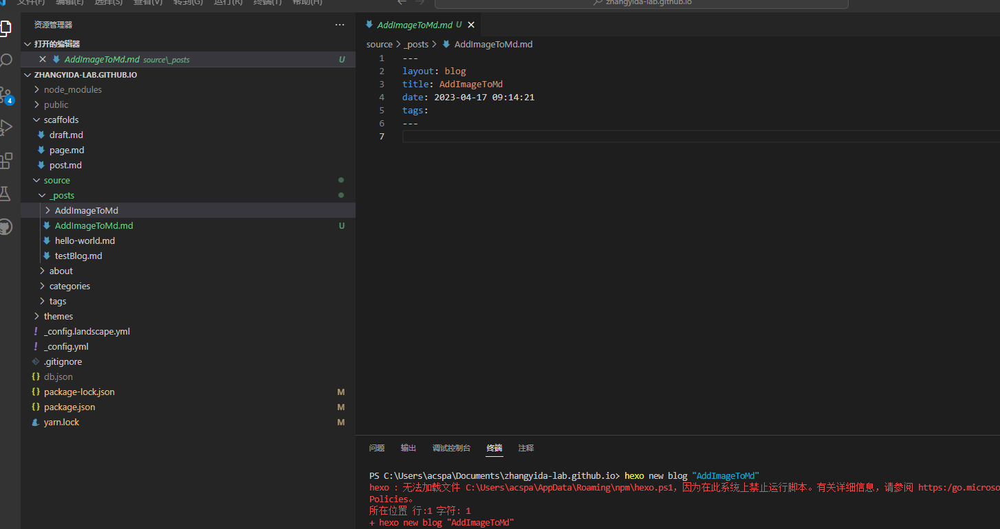

# Q&A about markdown

## <font color="green">\#</font> How to headings your word?

``` markdown
 # Heading
 represent level 1
```

## <font color="green">\#</font> How to emphasis your word?

``` markdown
 *heading* represent Italic
 **heading** represent Bold
```

<!--more-->

## <font color="green">\#</font> How to lists your word?

``` markdown
 1. first
 2. second 
represent Ordered Lists
 - first
 - second 
represent Unordered Lists
```


## <font color="orange">\#</font> How to add images in markdown?

```bash

```


## <font color="green">\#</font> How to add links in markdow?

``` markdown
Markdown basic syntax is [here](https://www.markdownguide.org/basic-syntax/)
```


Markdown basic syntax is [here](https://www.markdownguide.org/basic-syntax/)

## <font color="green">\#</font> How to color your word in markdown?

``` markdown
<font color="green"> i am green </font>
```

<font color="green"> I am GREEN </font>

## <font color="green">\#</font> How to use emoji in markdown?

``` markdown
:some strings:
```
:x:,  :link:

:link: The emoji list is [here](https://gist.github.com/rxaviers/7360908).
